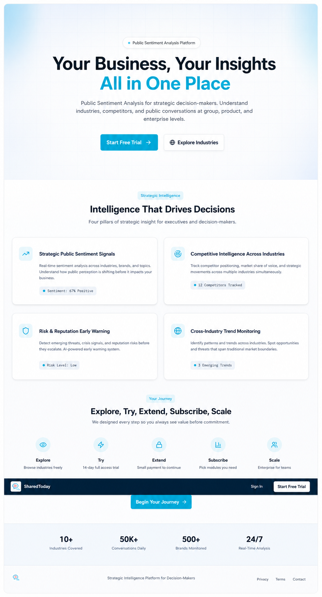
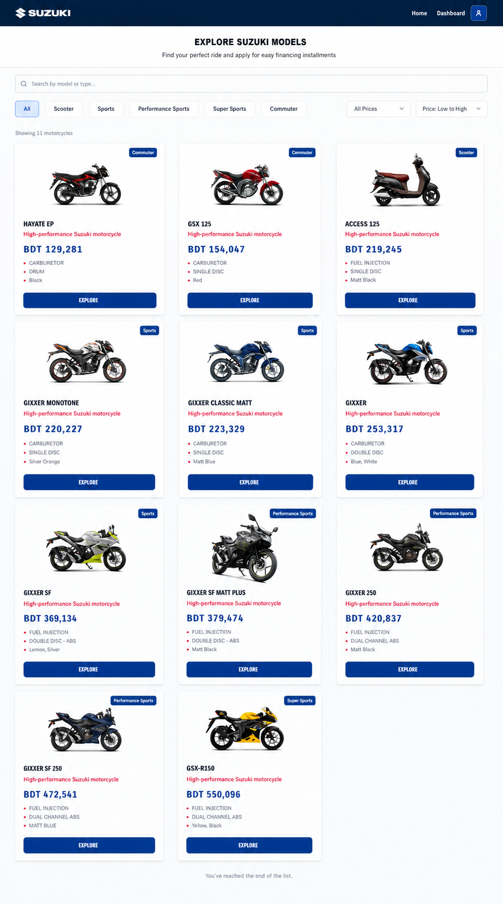
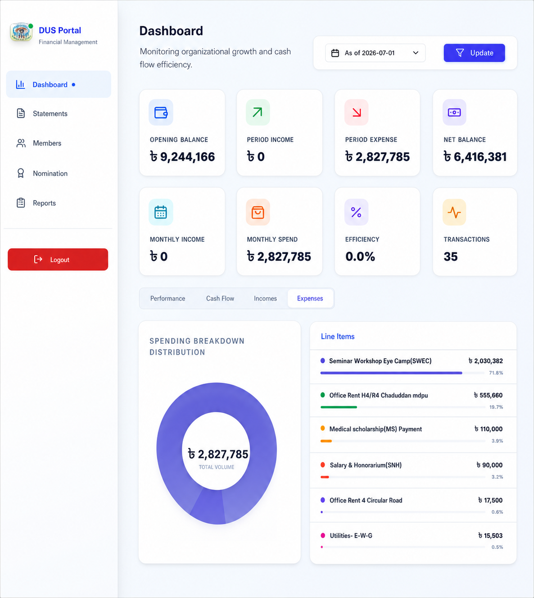

# Tauhid Hasan Chowdhury Portfolio

Production-ready personal portfolio and project showcase built with Next.js 16, React 19, TypeScript, Tailwind CSS 4, and Framer Motion.

## Project Overview
This repository contains the source for Tauhid Hasan Chowdhury's public portfolio site. It highlights professional experience, curated project case studies, skills, education, and direct contact workflows.

## Business Purpose
The site acts as a digital business card, credibility layer, and lead-generation surface for freelance work, full-time opportunities, and client project discovery.

## Vision
Create a polished, maintainable portfolio that presents software engineering and UI/UX capability with enough context for human recruiters, technical collaborators, and AI coding agents to continue improving it safely.

## Goals
- Present a strong personal brand and project narrative
- Showcase real project screenshots instead of generic placeholders
- Provide a direct contact path for inbound leads
- Keep the codebase easy to understand, update, and deploy
- Preserve repository knowledge so future contributors do not depend on undocumented context

## Key Features
- Single-page responsive portfolio experience
- Animated hero, navigation, and section transitions
- Rich project gallery with modal details and screenshot walkthroughs
- Skills, experience, education, and achievements sections
- Contact form backed by a Next.js API route using Nodemailer + Gmail
- Light/dark theme support
- Social/profile icon assets and project screenshots stored locally

## Screenshots




## Technology Stack
- Framework: Next.js 16 (App Router)
- UI: React 19
- Language: TypeScript
- Styling: Tailwind CSS 4
- Animation: Framer Motion
- Forms/API: Native React state + Next.js route handler
- Email Delivery: Nodemailer with Gmail App Password
- Deployment Target: Vercel
- Package Manager: pnpm

## Architecture Overview
- `app/`: App Router entrypoints, metadata, global styles, and API routes
- `components/sections/`: top-level portfolio sections
- `components/features/`: reusable feature-level UI building blocks
- `components/modals/`: project details and content overlays
- `data/`: structured content for projects, skills, education, experience, and blog data
- `lib/`: project-specific helpers and site configuration
- `public/`: local static assets including screenshots, profile images, and icons

See [ARCHITECTURE.md](ARCHITECTURE.md) for full details.

## Folder Structure
```text
.
├── app/
│   ├── api/send-email/
│   ├── globals.css
│   ├── layout.tsx
│   └── page.tsx
├── components/
│   ├── features/
│   ├── modals/
│   ├── sections/
│   └── ui/
├── data/
├── hooks/
├── lib/
├── public/
│   ├── profile/
│   └── projects/
├── .github/
├── AGENTS.md
├── ARCHITECTURE.md
├── CLAUDE.md
├── CONTRIBUTING.md
├── PROJECT_CONTEXT.md
├── PRD.md
└── SECURITY.md
```

## Installation Guide
### Prerequisites
- Node.js 20+
- pnpm 10+

### Install
```bash
pnpm install
```

## Local Development Setup
1. Copy `.env.example` to `.env.local`
2. Fill in the required Gmail credentials if you want the contact form to send email
3. Start the dev server:

```bash
pnpm dev
```

Open [http://localhost:3000](http://localhost:3000).

## Environment Configuration
Required variables:
- `NEXT_PUBLIC_SITE_URL`
- `GMAIL_USER`
- `GMAIL_APP_PASSWORD`

See [.env.example](.env.example).

## Build Commands
```bash
pnpm build
pnpm start
```

## Development Commands
```bash
pnpm dev
pnpm lint
pnpm typecheck
pnpm test
pnpm ci
```

## Testing Commands
Current automated verification:
```bash
pnpm lint
pnpm typecheck
pnpm test
pnpm build
```

Current note:
- `pnpm test` is presently a typecheck gate, not a full unit/integration suite yet.

## Deployment Instructions
### Vercel
1. Import the repository into Vercel
2. Add environment variables from `.env.example`
3. Set the production domain
4. Deploy from the default branch

### Manual Production Build
```bash
pnpm install --frozen-lockfile
pnpm ci
pnpm start
```

## Production Setup
- Provide Gmail credentials only in secure deployment environment settings
- Set a correct public site URL
- Confirm that the contact form route can access email secrets
- Verify image assets are present in `public/`

## Troubleshooting
- Contact form fails: verify `GMAIL_USER` and `GMAIL_APP_PASSWORD`
- Metadata points to wrong domain: update `lib/site.ts` and `NEXT_PUBLIC_SITE_URL`
- Missing screenshots: check `public/projects/*` paths and `data/projects.ts`
- Build issues after dependency changes: reinstall with `pnpm install`

## Frequently Asked Questions
### Is there a database?
No. The current portfolio is content-driven through local TypeScript data files.

### Are project screenshots generated or real?
Most current portfolio case-study images are polished edits of real product screenshots stored locally in `public/projects/`.

### Can this be extended into a CMS-backed portfolio?
Yes. The architecture is simple enough to migrate the `data/` layer into a CMS or database later.

## Useful Resources
- [Next.js Documentation](https://nextjs.org/docs)
- [React Documentation](https://react.dev)
- [Tailwind CSS](https://tailwindcss.com/docs)
- [Framer Motion](https://www.framer.com/motion/)
- [Nodemailer](https://nodemailer.com/about/)

## Related Project Docs
- [PRD.md](PRD.md)
- [PROJECT_CONTEXT.md](PROJECT_CONTEXT.md)
- [AGENTS.md](AGENTS.md)
- [CLAUDE.md](CLAUDE.md)
- [ARCHITECTURE.md](ARCHITECTURE.md)
